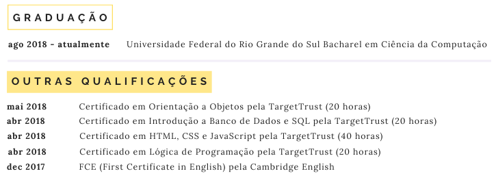

# Preenchendo o currículo
## Educação / Certificação
Nessa área deve ser colocado formações, cursos e certificados. É importante acrescentar o período de duração ou a data de aquisição da formação, curso ou certificado. A ordem ideal é sempre o evento mais atual em cima.

Não é relevante colocar o ensino médio, a não ser que este seja integrado com um curso técnico que seja relevante para o cargo desejado.

>  **Exemplo:** 
>
> Uma pessoa atua na área de programação, mas tem um técnico integrado em química. Essa informação é relevante caso ela vá atuar em uma empresa de produção de produtos químicos, por exemplo, mas não em uma rede de hotéis.

### No currículo
[]
>  A candidata optou por separar a graduação de outros certificados, assim dando maior destaque para o que ela considera mais relevante