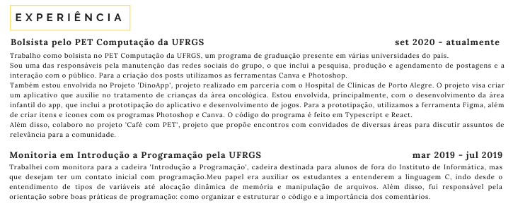

# Preenchendo o currículo
## Experiência
É interessante colocar uma breve descrição da sua atuação dentro do emprego / estágio / bolsa. Pensando em termos de espaço, as experiências mais antigas podem ter uma descrição mais sucinta, por acabarem sendo menos relevantes que as mais atuais.

Também vale destacar as experiências que sejam mais relevantes para o cargo de interesse, explicando com um pouco mais de detalhes seu papel. Para pessoas com pouca experiência, no entanto, qualquer experiência, mesmo que não profissional, pode ser colocada, desde que acrescente conteúdo relevante ao currículo.

A ordem ideal é sempre o evento mais atual em cima.

>  **Exemplo:** 
>
> Fazer parte do RH da escola é uma experiência interessante, que pode mostrar suas habilidades em administrar ou organizar eventos, lidar com documentos e em liderar.

### No currículo
[]