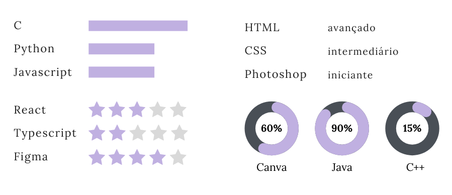

# Preenchendo o currículo
## Habilidades
Embora não seja necessário, é possível colocar o quanto você sabe de uma determinada habilidade e há várias formas de representar isso: palavras simples, barras de progresso, estrelas entre outros. O importante é manter um único formato. 

Também é relevante colocar *soft skills*.

>  ***Soft skills*:** habilidades que não estão relacionadas a um conhecimento acadêmico ou de alguma tecnologia, como, por exemplo, trabalho em grupo, organização, bom em apresentações, entre outros.

### No currículo
