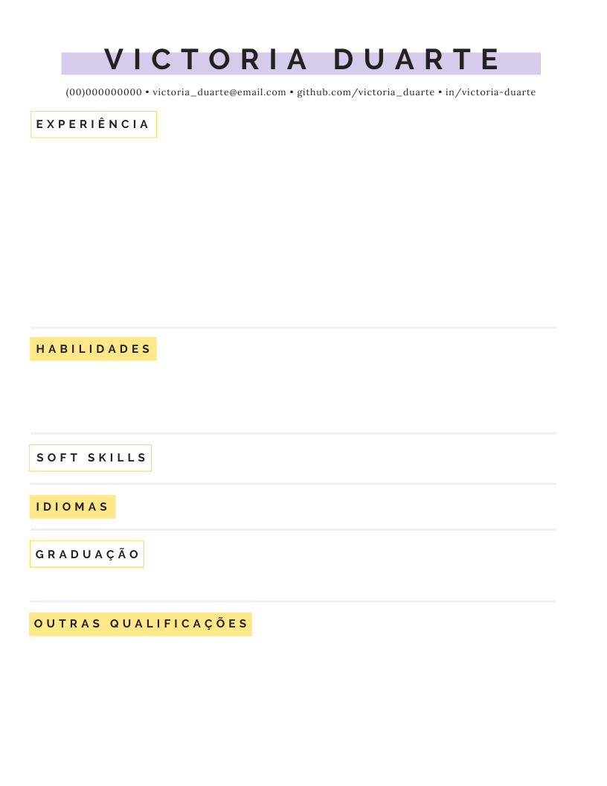

# Estruturando o Currículo
## Layout e design
No geral, costuma-se colocar nome e informações pessoais na parte superior da página, deixando as informações relacionadas a qualificações e competências na parte inferior. Recomenda-se colocar a experiência primeiro, seguida por habilidades e qualificações. Mas, não há uma regra específica para a distribuição, desde que o currículo seja claro.
O design costuma ser simples, a ideia do currículo é ser um documento formal objetivo e sucinto e, por esse motivo, o ideal é evitar muitas cores ou fontes chamativas.

### Exemplo de estruturação de currículo

>  Note que, no exemplo, como a candidata é programadora, é relevante colocar seu github